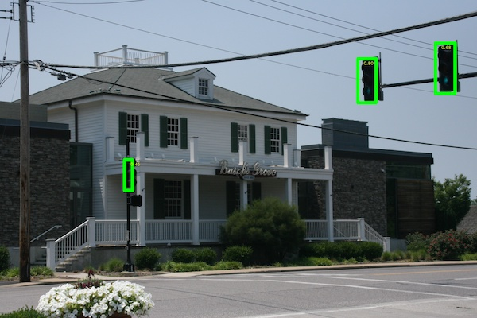

# CarND-TrafficLights
This is a project of traffic lights detector and classification of there's red light visible.

The main purpose of this project **was** to address Red Litht Detection sub-project of [the capstone project](https://github.com/udacity/CarND-Capstone) of [Self-Driving Car Engineer Nanodegree](https://www.udacity.com/course/self-driving-car-engineer-nanodegree--nd013) by [Udacity](https://www.udacity.com/). The intent of this code is to be reaty to be used on CARLA autonomous car.

The traing code can be easily switched to detect other types of objects.  
Feel free to experiment!

# BUT WAIT!

This is implementation in **pytorch** and there is no easy way to use this model for the Capstone project.  

**Keras** implementation you might find useful is here:  
[github: bwosh/keras-traffic-lights](https://github.com/bwosh/keras-traffic-lights)

# Results

Sample detector result:  


# Project desctiption

This is train and inference code of object detector for single class. It uses minimal version of implementation possible.

The code is ready to autimatically download COCO dataset annotations and extract photos for selected class.

Pre-trained model uses "Traffic light" class.

The code uses CenterNet implementation presented in ["Objects as Points"](https://arxiv.org/pdf/1904.07850.pdf).

Used backbone model is DLA-34 proposed in ["Deep Layer Aggregation"](https://arxiv.org/pdf/1707.06484.pdf).

# Implementation details

## Implementation notes
* Implementation uses PyTorch 1.0+ with CUDA 8+
* Selected images from COCO dataset are used
* Object detector is CenterNet (much code taken from [github.com/xingyizhou](https://github.com/xingyizhou/CenterNet) )
* Detector uses DLA-34 as backbone  (minified version of  code from [github.com/xingyizhou](https://github.com/xingyizhou/CenterNet/blob/master/src/lib/models/networks/dlav0.py)

# Install requirements

## Dependencies
* PyTorch
* albumantations
* numpy
* opencv (for opening/saving images, drawing boxes)

## Install prerequisites

```bash
cd src
pip install -r requirements.txt
```

# How to train

## 1. Download COCO photos by script
```bash
cd src
python get_coco_images.py \
   --class_name "traffic light" \
   --output ../data/coco
```

## 2. Train 

```bash
cd src
python train.py \
   --input ../data/coco \
   --output ../models \
```

# Inference

If you haven't trained model yourself you can download pretrained model and use for inference only:

### 1. Download pretrained model

* Download model from ([512_map3950.pth](https://www.dropbox.com/s/o22v1ew74hesvz9/512_map3950.pth?dl=0))
* Place pth file in **./model** folder

### 2. (optional) Check result on validation dataset

NOTICE: *The dataset must be downloaded berore this step.*

```bash
cd src
python train.py \
   --input ../data/coco \
   --output ../models \
   --restore ../models/512_map3950.pth \
   --val
```

### 3. Run demo script on folder with images

```bash
cd src
python inference.py \ 
   --folder [folder_with_images] \
   --model ../models/512_map3950.pth
```

And enjoy the photos in the same folder but with '_output.jpg'  suffix.